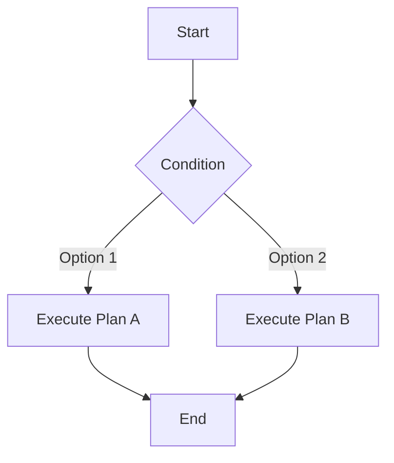

<div align="center">

# 🚀 Markdown Online Editor

**Professional Online Markdown Editor | Powered by VSCode Editor Core**

[](https://github.com/LiWeny16/MarkdownOnline)
[](./LICENSE-MIT)
[](https://reactjs.org/)
[](https://www.typescriptlang.org/)
[](https://microsoft.github.io/monaco-editor/)

[🌐 Live Demo](https://md.bigonion.cn) | [📖 中文文档](./README.md) | [🐛 Report Issues](https://github.com/LiWeny16/MarkdownOnline/issues)

</div>

---

## ✨ Introduction

**Markdown Online Editor** is a powerful online Markdown editor integrated with VSCode Monaco Editor core, providing a professional-grade editing experience. No installation required - enjoy a desktop-like smooth experience right in your browser.

### 🎯 Key Features

- 🎨 **Monaco Editor** - Powered by VSCode editor core with complete syntax highlighting and IntelliSense
- 📁 **File Management** - Support for folders, multi-file management, and local storage persistence
- 🎭 **Real-time Preview** - Dual-pane synchronized scrolling with WYSIWYG experience
- 🧮 **LaTeX Formulas** - Complete mathematical formula rendering support (KaTeX)
- 📊 **Mermaid Diagrams** - Flowcharts, sequence diagrams, Gantt charts, and more
- 🎨 **Code Highlighting** - Syntax highlighting for 100+ programming languages
- 🖼️ **Image Management** - Local image upload, management, and preview
- 🌓 **Theme Switching** - Light and dark themes to protect your eyes
- 💾 **Export Features** - Support for PDF, HTML, and other formats
- ⚡ **AI Assistant** - Integrated AI writing assistant
- 📱 **Responsive Design** - Perfect adaptation for mobile and desktop

## 🚀 Quick Start

### 📦 Installation

```bash
# Using npm
npm install

# Or using yarn
yarn install

# Or using pnpm
pnpm install
```

### 💻 Local Development

```bash
# Start development server
npm run dev

# Visit http://localhost:5173
```

### 🏗️ Build for Production

```bash
# Build the project
npm run build

# Preview the build
npm run preview
```

### 🌐 Deployment

#### Vercel Deployment (Recommended)

1. Fork this project to your GitHub account
2. Import the project on [Vercel](https://vercel.com)
3. One-click deployment with automatic configuration

#### Netlify Deployment

1. Connect your GitHub repository
2. Build command: `npm run build`
3. Publish directory: `docs`

#### Self-hosted Deployment

```bash
# Build the project
npm run build

# Deploy the docs directory to your server
# Host static files with Nginx, Apache, or other web servers
```

**Nginx Configuration Example:**

```nginx
server {
    listen 80;
    server_name your-domain.com;
    root /path/to/docs;
    index index.html;

    location / {
        try_files $uri $uri/ /index.html;
    }
}
```

## 📚 Tech Stack

| Technology | Description |
|------------|-------------|
| **React 18** | Modern component-based UI framework |
| **TypeScript** | Type-safe JavaScript superset |
| **Vite** | Next-generation frontend build tool |
| **Monaco Editor** | VSCode editor core for professional coding |
| **MobX** | Simple and scalable state management |
| **Material-UI** | React UI component library |
| **markdown-it** | Powerful Markdown parser |
| **KaTeX** | Fast math typesetting library |
| **Mermaid** | Text-based diagram generation |
| **Vite PWA** | Progressive Web App support |

## 📖 Usage Guide

### LaTeX Mathematical Formulas

Use `$$` for block formulas and `$` for inline formulas:

```latex
Block formula:
$$
E = mc^2
$$

Inline formula: The mass-energy equation $E = mc^2$ is important
```

### Mermaid Flowcharts

Use code blocks with `mermaid` language:

````markdown

````

### Emoji

Use emoji codes directly:

```markdown
:heart: :smile: :rocket: :star:
```

### Code Highlighting

Support for 100+ programming languages:

````markdown
```python
def hello_world():
    print("Hello, Markdown!")
```

```javascript
const greeting = () => {
    console.log("Hello, Markdown!");
};
```
````

### Enhanced Tables

Support for multi-line tables (multimd-table):

```markdown
|             |          Grouping           ||
| First Header  | Second Header | Third Header |
| ------------- | :-----------: | -----------: |
| Content       |          *Long Cell*        ||
| Content       |   **Cell**    |         Cell |
```

### Task Lists

```markdown
- [x] Completed task
- [ ] Pending task
- [ ] Another todo item
```

For more syntax, see the [Complete Markdown Guide](https://www.markdownguide.org/)

## 🗺️ Roadmap

### ✅ Completed

- ✅ VSCode Monaco Editor integration
- ✅ Complete file management system (with folder support)
- ✅ LaTeX mathematical formula rendering
- ✅ Mermaid diagram support
- ✅ AI writing assistant integration
- ✅ PDF/HTML export functionality
- ✅ Image manager
- ✅ Table of contents (TOC) auto-generation
- ✅ Multi-theme support
- ✅ PWA support

### 🚧 In Progress

- 🚧 WebAssembly script runtime environment
- 🚧 Jupyter-style code cell execution

### 📋 Planned

- 📋 Real-time collaborative editing
- 📋 Cloud synchronization
- 📋 Enhanced AI features
- 📋 Plugin system

## 🤝 Contributing

Contributions, issues, and feature requests are welcome!

1. Fork this project
2. Create your feature branch (`git checkout -b feature/AmazingFeature`)
3. Commit your changes (`git commit -m 'Add some AmazingFeature'`)
4. Push to the branch (`git push origin feature/AmazingFeature`)
5. Open a Pull Request

## 📄 License

This project is licensed under the [MIT](./LICENSE-MIT) License

```
Copyright (c) 2022-present Bigonion
```

[](https://app.fossa.com/projects/git%2Bgithub.com%2FLiWeny16%2FMarkdownOnline?ref=badge_large&issueType=license)

## 🔗 Links

- **Live Demo**: [md.bigonion.cn](https://md.bigonion.cn)
- **GitHub**: [github.com/LiWeny16/MarkdownOnline](https://github.com/LiWeny16/MarkdownOnline)
- **Author**: [bigonion.cn](https://bigonion.cn)
- **Issues**: [GitHub Issues](https://github.com/LiWeny16/MarkdownOnline/issues)

## 👨‍💻 About the Author

**Bigonion**
- 📧 Email: bigonion@bigonion.cn
- 🌐 Website: [bigonion.cn](https://bigonion.cn)

## 🙏 Acknowledgments

Thanks to all contributors who have helped make this project better:

<a href="https://github.com/LiWeny16/MarkdownOnline/graphs/contributors">
  
</a>

Special thanks to these amazing open-source projects:

- [React](https://reactjs.org/) - JavaScript library for building user interfaces
- [Monaco Editor](https://microsoft.github.io/monaco-editor/) - VSCode editor core
- [Vite](https://vitejs.dev/) - Next-generation frontend build tool
- [markdown-it](https://github.com/markdown-it/markdown-it) - Markdown parser
- [KaTeX](https://katex.org/) - Math typesetting library
- [Mermaid](https://mermaid.js.org/) - Diagram generation tool

For a complete list of dependencies, see the [Dependency Report](/public/LICENSES/report.md)

---

<div align="center">

**If this project helps you, please give it a ⭐️**

Made with ❤️ by [Bigonion](https://github.com/LiWeny16)

</div>
