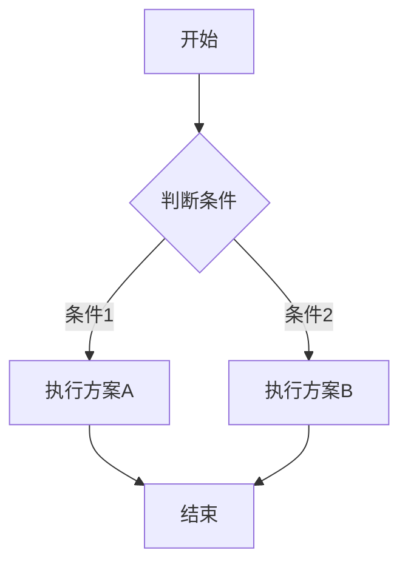

<div align="center">

# 🚀 Markdown Online Editor

**专业级在线 Markdown 编辑器 | 基于 VSCode 编辑器内核**

[](https://github.com/LiWeny16/MarkdownOnline)
[](./LICENSE-MIT)
[](https://reactjs.org/)
[](https://www.typescriptlang.org/)
[](https://microsoft.github.io/monaco-editor/)

[🌐 在线体验](https://md.bigonion.cn) | [📖 English](./README-EN.md) | [🐛 问题反馈](https://github.com/LiWeny16/MarkdownOnline/issues)

</div>

---

## ✨ 项目简介

**Markdown Online Editor** 是一款功能强大的在线 Markdown 编辑器，集成了 VSCode Monaco 编辑器内核，提供专业级的编辑体验。无需安装，打开浏览器即可享受媲美桌面应用的流畅体验。

### 🎯 核心特性

- 🎨 **Monaco 编辑器** - 基于 VSCode 的强大编辑器内核，完整的语法高亮和智能提示
- 📁 **文件管理系统** - 支持文件夹、多文件管理，本地存储持久化
- 🎭 **实时预览** - 双栏同步滚动，所见即所得
- 🧮 **LaTeX 公式** - 完整的数学公式渲染支持（KaTeX）
- 📊 **Mermaid 图表** - 流程图、时序图、甘特图等多种图表
- 🎨 **代码高亮** - 支持 100+ 编程语言语法高亮
- 🖼️ **图片管理** - 本地图片上传、管理和预览
- 🌓 **主题切换** - 支持明暗主题，保护您的眼睛
- 💾 **导出功能** - 支持 PDF、HTML 等多种格式导出
- ⚡ **AI 辅助** - 集成 AI 助手，智能写作辅助
- 📱 **响应式设计** - 完美适配移动端和桌面端

## 🚀 快速开始

### 📦 安装依赖

```bash
# 使用 npm
npm install

# 或使用 yarn
yarn install

# 或使用 pnpm
pnpm install
```

### 💻 本地开发

```bash
# 启动开发服务器
npm run dev

# 访问 http://localhost:5173
```

### 🏗️ 构建生产版本

```bash
# 构建项目
npm run build

# 预览构建结果
npm run preview
```

### 🌐 部署

#### Vercel 部署（推荐）

1. Fork 本项目到您的 GitHub 账号
2. 在 [Vercel](https://vercel.com) 导入项目
3. 一键部署，自动配置


## 📚 技术栈

| 技术 | 说明 |
|------|------|
| **React 18** | 前端框架，提供现代化的组件开发体验 |
| **TypeScript** | 类型安全的 JavaScript 超集 |
| **Vite** | 下一代前端构建工具，极速开发体验 |
| **Monaco Editor** | VSCode 编辑器内核，专业级代码编辑 |
| **MobX** | 简单、可扩展的状态管理 |
| **Material-UI** | React UI 组件库 |
| **markdown-it** | 强大的 Markdown 解析器 |
| **KaTeX** | 快速的数学公式渲染引擎 |
| **Mermaid** | 文本驱动的图表生成工具 |
| **Vite PWA** | 渐进式 Web 应用支持 |

## 📖 使用指南

### LaTeX 数学公式

使用 `$$` 包裹块级公式，`$` 包裹行内公式：

```latex
块级公式：
$$
E = mc^2
$$

行内公式：质能方程 $E = mc^2$ 很重要
```

### Mermaid 流程图

使用代码块并指定 `mermaid` 语言：

````markdown

````

### Emoji 表情

直接使用 emoji 代码：

```markdown
:heart: :smile: :rocket: :star:
```

### 代码高亮

支持 100+ 编程语言：

````markdown
```python
def hello_world():
    print("Hello, Markdown!")
```

```javascript
const greeting = () => {
    console.log("Hello, Markdown!");
};
```
````

### 表格增强

支持多行表格（multimd-table）：

```markdown
|             |          Grouping           ||
| First Header  | Second Header | Third Header |
| ------------- | :-----------: | -----------: |
| Content       |          *Long Cell*        ||
| Content       |   **Cell**    |         Cell |
```

### 任务列表

```markdown
- [x] 已完成的任务
- [ ] 待完成的任务
- [ ] 另一个待办事项
```

更多语法请参考 [Markdown 完整指南](https://markdown.com.cn/intro.html)

## 🗺️ 开发路线图

### ✅ 已完成

- ✅ VSCode Monaco 编辑器集成
- ✅ 完整的文件管理系统（支持文件夹）
- ✅ LaTeX 数学公式渲染
- ✅ Mermaid 图表支持
- ✅ AI 写作助手集成
- ✅ PDF/HTML 导出功能
- ✅ 图片管理器
- ✅ 目录（TOC）自动生成
- ✅ 多主题支持
- ✅ PWA 支持

### 🚧 开发中

- 🚧 WebAssembly 脚本运行环境
- 🚧 Jupyter 风格的代码单元格执行

### 📋 计划中

- 📋 实时协同编辑
- 📋 云端同步
- 📋 更多 AI 功能增强
- 📋 插件系统

## 🤝 贡献指南

欢迎贡献代码、报告问题或提出建议！

1. Fork 本项目
2. 创建您的特性分支 (`git checkout -b feature/AmazingFeature`)
3. 提交您的更改 (`git commit -m 'Add some AmazingFeature'`)
4. 推送到分支 (`git push origin feature/AmazingFeature`)
5. 打开一个 Pull Request

## 📄 开源协议

本项目采用 [MIT](./LICENSE-MIT) 协议开源

```
Copyright (c) 2022-present Bigonion
```

[](https://app.fossa.com/projects/git%2Bgithub.com%2FLiWeny16%2FMarkdownOnline?ref=badge_large&issueType=license)

## 🔗 相关链接

- **在线体验**: [md.bigonion.cn](https://md.bigonion.cn)
- **GitHub**: [github.com/LiWeny16/MarkdownOnline](https://github.com/LiWeny16/MarkdownOnline)
- **作者主页**: [bigonion.cn](https://bigonion.cn)
- **问题反馈**: [Issues](https://github.com/LiWeny16/MarkdownOnline/issues)

## 👨‍💻 关于作者

**Bigonion**
- 📧 Email: bigonion@bigonion.cn
- 🌐 Website: [bigonion.cn](https://bigonion.cn)

## 🙏 致谢

感谢所有为本项目做出贡献的开发者：

<a href="https://github.com/LiWeny16/MarkdownOnline/graphs/contributors">
  
</a>

感谢以下开源项目的支持：

- [React](https://reactjs.org/) - 用于构建用户界面的 JavaScript 库
- [Monaco Editor](https://microsoft.github.io/monaco-editor/) - VSCode 编辑器内核
- [Vite](https://vitejs.dev/) - 下一代前端构建工具
- [markdown-it](https://github.com/markdown-it/markdown-it) - Markdown 解析器
- [KaTeX](https://katex.org/) - 数学公式渲染
- [Mermaid](https://mermaid.js.org/) - 图表生成工具

完整的依赖列表请查看 [依赖报告](/public/LICENSES/report.md)

---

<div align="center">

**如果这个项目对您有帮助，请给它一个 ⭐️**

Made with ❤️ by [Bigonion](https://github.com/LiWeny16)

</div>
