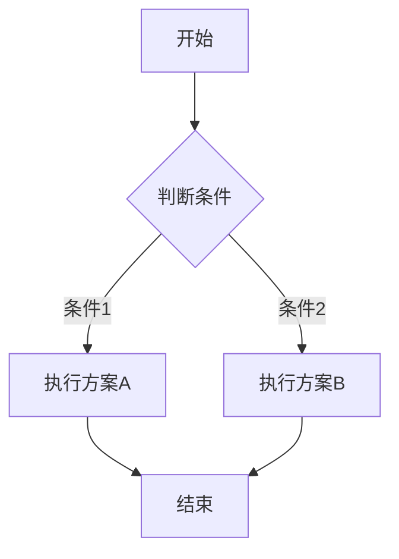

<div align="center">

# 🚀 Markdown Online Editor

**专业级在线 Markdown 编辑器 | 基于 VSCode Monaco 编辑器内核**

[](https://github.com/LiWeny16/MarkdownOnline)
[](./LICENSE-MIT)
[](https://reactjs.org/)
[](https://www.typescriptlang.org/)
[](https://microsoft.github.io/monaco-editor/)

[🌐 在线体验](https://md.bigonion.cn) | [📖 English](./README-EN.md) | [🐛 问题反馈](https://github.com/LiWeny16/MarkdownOnline/issues)

</div>

---

## ✨ 项目简介

**Markdown Online Editor** 是一款功能强大的在线 Markdown 编辑器，集成了驱动 Visual Studio Code 的 **Monaco Editor** 编辑器内核——全球超过 **2,000 万开发者** 日常使用的编辑器技术。Markdown 作为技术写作的事实标准，已被 GitHub、GitLab、Stack Overflow、Reddit 等平台采用，**超过 90% 的技术文档** 使用 Markdown 格式编写。

本项目将桌面级的专业编辑体验带到浏览器中——无需安装任何软件，即可享受媲美 VS Code 的流畅体验。

### 🎯 核心特性

- 🎨 **Monaco 编辑器** - 驱动 VS Code 的工业级编辑器内核，提供完整的语法高亮和智能补全（IntelliSense）
- 📁 **文件管理系统** - 支持文件夹、多文件管理，基于 LocalStorage 的持久化存储
- 🎭 **实时预览** - 双栏同步滚动渲染，所见即所得（WYSIWYG）
- 🧮 **LaTeX 公式** - 基于 KaTeX 引擎的数学公式渲染，KaTeX 被 Khan Academy、Stack Exchange 等平台采用
- 📊 **Mermaid 图表** - 支持流程图、时序图、甘特图、类图、状态图等多种图表类型
- 🎨 **代码高亮** - 支持 100+ 编程语言语法高亮，覆盖主流和新兴语言
- 🖼️ **图片管理** - 本地图片上传、管理和预览，支持拖放操作
- 🌓 **主题切换** - 明暗主题切换，减少长时间写作的眼疲劳
- 💾 **导出功能** - 支持 PDF、HTML 等多种格式导出，保留完整格式和图表
- ⚡ **AI 辅助** - 集成 AI 写作助手，提供智能续写和内容优化
- 📱 **响应式设计** - 完美适配移动端和桌面端，支持 PWA 离线使用

## 🚀 快速开始

### 📦 安装依赖

```bash
# 使用 npm
npm install

# 或使用 yarn
yarn install

# 或使用 pnpm（推荐，磁盘效率更高）
pnpm install
```

### 💻 本地开发

```bash
# 启动开发服务器（基于 Vite，毫秒级热更新）
npm run dev

# 访问 http://localhost:5173
```

### 🏗️ 构建生产版本

```bash
# 构建生产版本（含 Tree Shaking 和代码分割）
npm run build

# 预览构建结果
npm run preview
```

### 🌐 部署

#### Vercel 部署（推荐）

1. Fork 本项目到您的 GitHub 账号
2. 在 [Vercel](https://vercel.com) 导入项目
3. 一键部署，自动配置 CDN 和 HTTPS

项目也支持部署到 Netlify、Cloudflare Pages、GitHub Pages 等现代静态托管平台。

## 📚 技术栈

| 技术 | 分类 | 说明 |
|------|------|------|
| **React 18** | 前端框架 | 采用 Concurrent 渲染模式，提供现代化的组件开发体验 |
| **TypeScript** | 类型系统 | 静态类型检查，减少运行时错误 |
| **Vite** | 构建工具 | 基于 esbuild 和 Rollup，开发服务器启动速度提升 10x+ |
| **Monaco Editor** | 编辑器内核 | Visual Studio Code 的开源编辑器组件，完整保留 VSCode 编辑体验 |
| **MobX** | 状态管理 | 响应式状态管理，透明的函数响应式编程（TFRP） |
| **Material-UI** | UI 框架 | 遵循 Google Material Design 规范 |
| **markdown-it** | Markdown 解析 | 插件化的 Markdown 解析器，GitHub 7,000+ Stars |
| **KaTeX** | 公式渲染 | 比 MathJax 快 10x 的数学公式渲染引擎 |
| **Mermaid** | 图表生成 | 文本驱动的图表生成工具，GitHub 72,000+ Stars |
| **Vite PWA** | 离线支持 | 渐进式 Web 应用，支持离线缓存和安装 |

## 📖 使用指南

### LaTeX 数学公式

基于 KaTeX 引擎（Khan Academy 开发的极速 LaTeX 渲染器），支持行内和块级公式：

```latex
块级公式：
$$
E = mc^2
$$

行内公式：质能方程 $E = mc^2$ 由爱因斯坦于 1905 年提出
```

支持的数学环境包括矩阵、积分、求和、极限、希腊字母、运算符等标准 LaTeX 语法。

### Mermaid 图表

遵循 Mermaid 标准语法（被 GitHub、GitLab 原生支持），在代码块中指定 `mermaid` 语言：

````markdown

```mermaid
graph TD
    A[开始] --> B{判断条件}
    B -->|条件1| C[执行方案A]
    B -->|条件2| D[执行方案B]
    C --> E[结束]
    D --> E
```
````

支持的图表类型：流程图（Flowchart）、时序图（Sequence Diagram）、甘特图（Gantt Chart）、类图（Class Diagram）、状态图（State Diagram）、ER 图（Entity Relationship Diagram）、饼图（Pie Chart）。

### Emoji 表情

遵循 GitHub Emoji 规范，直接使用简写代码：

```markdown
:heart: :smile: :rocket: :star:
```

### 代码高亮

基于 highlight.js，支持 100+ 编程语言：

````markdown
```python
def hello_world():
    print("Hello, Markdown!")
```

```javascript
const greeting = () => {
    console.log("Hello, Markdown!");
};
```
````

覆盖 JavaScript、TypeScript、Python、Rust、Go、Java、C++、SQL 等主流编程语言。

### 表格增强

基于 markdown-it-multimd-table 插件，支持复杂的多行表格和列合并：

```markdown
|             |          Grouping           ||
| First Header  | Second Header | Third Header |
| ------------- | :-----------: | -----------: |
| Content       |          *Long Cell*        ||
| Content       |   **Cell**    |         Cell |
```

### 任务列表

支持 GitHub Flavored Markdown 任务列表：

```markdown
- [x] 已完成的任务
- [ ] 待完成的任务
- [ ] 另一个待办事项
```

更多语法请参考 [Markdown 完整指南](https://markdown.com.cn/intro.html)

## 🗺️ 开发路线图

### ✅ 已完成

- ✅ VSCode Monaco 编辑器集成（含 IntelliSense 智能补全）
- ✅ 完整的文件管理系统（支持文件夹层级结构）
- ✅ LaTeX 数学公式渲染（KaTeX，支持 40+ 数学环境）
- ✅ Mermaid 图表支持（7 种图表类型）
- ✅ AI 写作助手集成
- ✅ PDF/HTML 导出（保留完整格式和样式）
- ✅ 图片管理器
- ✅ TOC 目录自动生成（markdown-it-github-toc）
- ✅ 多主题支持（亮色/暗色，跟随系统偏好）
- ✅ PWA 离线支持

### 🚧 开发中

- 🚧 WebAssembly 脚本运行环境 — 在浏览器中直接运行 Python/JavaScript 代码
- 🚧 Jupyter 风格代码单元格 — 交互式代码执行和可视化

### 📋 计划中

- 📋 实时协同编辑 — 基于 WebSocket/WebRTC 的多人协作
- 📋 云端同步 — 支持 GitHub Gist、GitLab Snippet 等多平台同步
- 📋 高级 AI 功能 — 内容总结、翻译、语法检查和风格优化
- 📋 插件系统 — 开放的扩展架构，支持社区贡献

## 🤝 贡献指南

欢迎贡献代码、报告问题或提出建议！本项目遵循开源社区最佳实践。

1. Fork 本项目
2. 创建您的特性分支 (`git checkout -b feature/AmazingFeature`)
3. 提交您的更改 (`git commit -m 'Add some AmazingFeature'`)
4. 推送到分支 (`git push origin feature/AmazingFeature`)
5. 打开一个 Pull Request

## 📄 开源协议

本项目采用 [MIT](./LICENSE-MIT) 协议开源 —— 这是开源社区最宽松的许可协议之一，允许自由使用、修改和分发。

```
Copyright (c) 2022-present Bigonion
```

[](https://app.fossa.com/projects/git%2Bgithub.com%2FLiWeny16%2FMarkdownOnline?ref=badge_large&issueType=license)

## ❓ 常见问题（FAQ）

### Markdown Online Editor 是什么？

Markdown Online Editor 是一款基于 VSCode Monaco 编辑器内核的专业在线 Markdown 编辑器。它提供实时双栏预览、LaTeX 数学公式渲染（KaTeX）、Mermaid 图表支持、100+ 编程语言代码高亮、AI 写作辅助等功能。完全开源（MIT 协议），打开浏览器即可使用，无需安装任何软件。

### 和 VS Code 的 Markdown 编辑有什么不同？

本项目使用与 VS Code 相同的 Monaco Editor 内核，保留了完整的编辑器功能（语法高亮、智能补全、代码折叠等），同时增加了：实时预览、一键导出（PDF/HTML）、Mermaid 图表渲染、AI 写作助手、文件管理等增强功能，且无需安装任何软件。

### 是否需要注册账号？

不需要。所有数据存储在浏览器的 LocalStorage 中，不会上传到任何服务器。你的文档完全私密，保存在本地。

### 如何导出我的文档？

支持导出为 PDF（保留完整格式和图表）、HTML（独立文件，包含样式）、Markdown 源文件（.md）等格式。导出操作完全在浏览器端完成，无需服务端支持。

### 数据安全吗？

数据完全存储在浏览器本地，不会上传到服务器。项目为 MIT 开源协议，源码完全透明，可以自行构建部署。对于敏感内容，建议使用本地部署版本。

## 🔗 相关链接

- **在线体验**: [md.bigonion.cn](https://md.bigonion.cn)
- **GitHub 仓库**: [github.com/LiWeny16/MarkdownOnline](https://github.com/LiWeny16/MarkdownOnline)
- **作者主页**: [bigonion.cn](https://bigonion.cn)
- **问题反馈**: [GitHub Issues](https://github.com/LiWeny16/MarkdownOnline/issues)

## 👨‍💻 关于作者

**Bigonion**
- 📧 Email: bigonion@bigonion.cn
- 🌐 Website: [bigonion.cn](https://bigonion.cn)

## 🙏 致谢

感谢所有为本项目做出贡献的开发者：

<a href="https://github.com/LiWeny16/MarkdownOnline/graphs/contributors">
  
</a>

感谢以下开源项目的支持：

- [React](https://reactjs.org/) - Meta 开源的 JavaScript 用户界面库，全球数百万开发者使用
- [Monaco Editor](https://microsoft.github.io/monaco-editor/) - Microsoft 开源的 VSCode 编辑器内核
- [Vite](https://vitejs.dev/) - Evan You 创建的下一代前端构建工具
- [markdown-it](https://github.com/markdown-it/markdown-it) - 高性能可扩展的 Markdown 解析器
- [KaTeX](https://katex.org/) - Khan Academy 创作的极速数学公式渲染引擎
- [Mermaid](https://mermaid.js.org/) - 文本驱动的图表生成工具

完整的依赖列表请查看 [依赖报告](/public/LICENSES/report.md)

---

<div align="center">

**如果这个项目对您有帮助，请给它一个 ⭐️**

Made with ❤️ by [Bigonion](https://github.com/LiWeny16)

</div>
