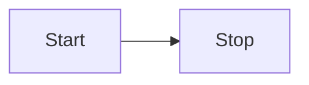

[TOC]

## Next-Generation "Markdown" Editor📣

1. If you're not familiar with Markdown, please visit [Markdown Introduction](https://markdown.com.cn/cheat-sheet.html#overview). Here's a brief introduction:
   - The left side is the source code
   - The right side is the rendered result
   - Try typing `# Hello` on a new line, and you'll see it becomes a heading on the right!

## 1. The Most Amazing Markdown Editor Ever😀

1. Currently the world's best free web-based Markdown editor written by onion
2. Type a forward slash character: `/` on a new line to see quick suggestions for flowcharts, code blocks, and more!
3. Right-click also has a bunch of magical features!
4. Export to PDF is in the "More" menu at the top right, or press `Ctrl + P` directly
5. Free, unlimited duration, high-accuracy speech-to-text conversion - come try it!
6. The smartest synchronized scrolling algorithm, most efficient code rendering, most modern UI interface, and coolest magical features!
7. Double-click on the right side to quickly locate the corresponding code on the left - seriously, everyone who's used it says it's super convenient!
8. The most comprehensive keyboard shortcuts, bar none:
   - `Ctrl + V` Upload copied and screenshot JPG/PNG images
   - `Ctrl + Z` Undo edit
   - `Ctrl + F` Find and replace
   - `Ctrl + E/R` Center/right align text
   - `Ctrl + B` Bold text
   - `Ctrl + U` Underline
   - `Ctrl + I` Italic text
   - `Ctrl + 1-4` Level 1-4 headings
   - `` Ctrl + ` `` Strikethrough
   - `Ctrl + Q` Synchronized scrolling
   - `Ctrl + Shift + F` File manager
   - `Ctrl + S` Save
   - `Ctrl + M` Insert a LaTeX code block
   - `Shift + Alt + F` Format Markdown
   - `Ctrl + Alt + V` Speech to text
   - More shortcuts coming soon...

## 2. Common Markdown Syntax

- This uses an unordered list - can you guess what an ordered list looks like?
- Hello, I'm LaTeX with syntax highlighting! For syntax reference, see: [LaTeX Formula Table](https://blog.csdn.net/Yushan_Ji/article/details/134322574)
  $$
  \lambda+1=\lambda^3-1
  $$
- No more tutorials - it's really **that simple**!

## 3. Flowcharts? Mind Maps? Pie Charts? We've Got Them All!✨

Yes, right below! Type a forward slash `/`, then type "flow", and press Enter!

## 4. Super User-Friendly Image Manager

1. Click "More" in the top right corner to open the file manager, open a folder and grant authorization
2. Take a screenshot (or copy an image file)
3. Paste (anywhere here)

Yes, it's that simple!!

## 5. On the Agenda

- Collaborative Office
- Sharing
- Online Python Execution

## 6. About Me and This Project

https://github.com/LiWeny16/MarkdownOnline

[^1]: These are footnotes for explaining things!
[^2]: This is the second footnote!
