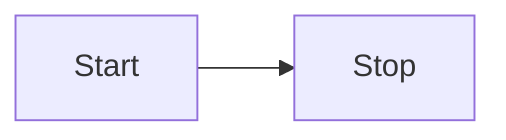

[TOC]

## 新一代的“Markdown”编辑器📣

1. 如果你还不清楚什么是markdown的话请移步[markdown简介](https://markdown.com.cn/cheat-sheet.html#总览), 下面是一些简短的介绍：
   - 左边是源代码
   - 右边是渲染出来的结果
   - 试着在新的一行打出一个# 你好, 在右边就会发现变成标题了！

## 一、QQ咩咩好用到爆炸的Markdown编辑器😀

1. 目前全世界最好用的onion写的Web端Markdown免费编辑器
2. 在新的一行打一个斜杠字符：`/`，即可看到流程图、代码块等快捷提示！
3. 鼠标右键也有一堆神奇功能！
4. 导出为PDF在右上角更多里，直接按下`Ctrl + P`也可以哦
5. 免费、不限时长、高准确率的语音转文字，还不快来试试！
6. 最智能的同步滚动算法，最高效的代码渲染效率，最现代的UI界面，最酷炫的神奇功能！
7. 双击右侧能快速定位到左侧对应代码，说真的，用过的都说太方便了！
8. 最全快捷键，没有之一
   - `Ctrl + V` 上传复制和截图的JPG、PNG格式图片
   - `Ctrl + Z` 撤回编辑
   - `Ctrl + F` 查找与替换
   - `Ctrl + E/R` 文本居中/右
   - `Ctrl + B` 文本加粗
   - `Ctrl + U` 下划线
   - `Ctrl + I` 文本斜体
   - `Ctrl + 1-4` 1-4级标题
   - `` Ctrl + ` `` 删除线
   - `Ctrl + Q` 同步滚动
   - `Ctrl + Shift + F` 文件管理器
   - `Ctrl + S` 保存
   - `Ctrl + M` 插入一个LaTex代码块
   - `Shift + Alt + F` 格式化Markdown
   - `Ctrl + Alt + V` 语音转文字
   - 更多快捷键，敬请期待...

## 二、常用的Makrdown语法

- 这就用了无序列表了，那你猜猜，有序列表是什么呢？
- 你好，我是带语法提示的LaTex！语法参见：[LaTex公示表](https://blog.csdn.net/Yushan_Ji/article/details/134322574)
  $$
  \lambda+1=\lambda^3-1
  $$
- 不教学了，真的**很简单**！

## 三、流程图？思维导图？饼图？统统拿下！✨

对，就在下面，打一个斜杠/，再打flow，回车！

## 四、超Newbee的图片管理器

1. 点击右上角更多打开文件管理器，打开文件夹并授权
2. 截图 （或者是复制图片文件）
3. 粘贴 （到这里任何地方）

是的，就这么简单！！

## 五、提上日程

- 协同办公
- 分享
- 在线运行Python

## 六、关于我和这个项目

https://github.com/LiWeny16/MarkdownOnline

[^1]: 就是解释一些东西的脚注啦！
[^2]: 这是第二个脚注！
